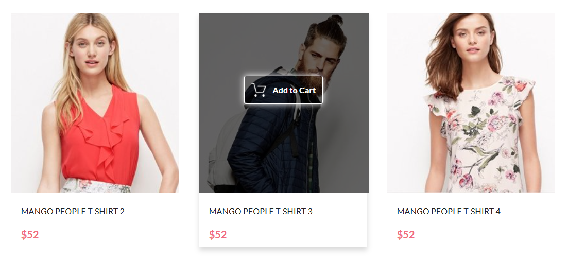
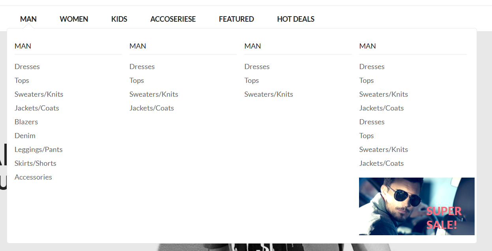
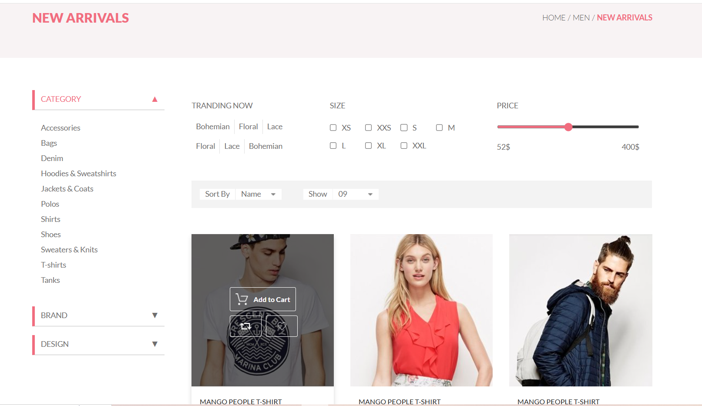
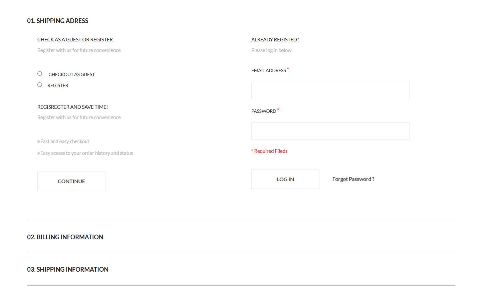
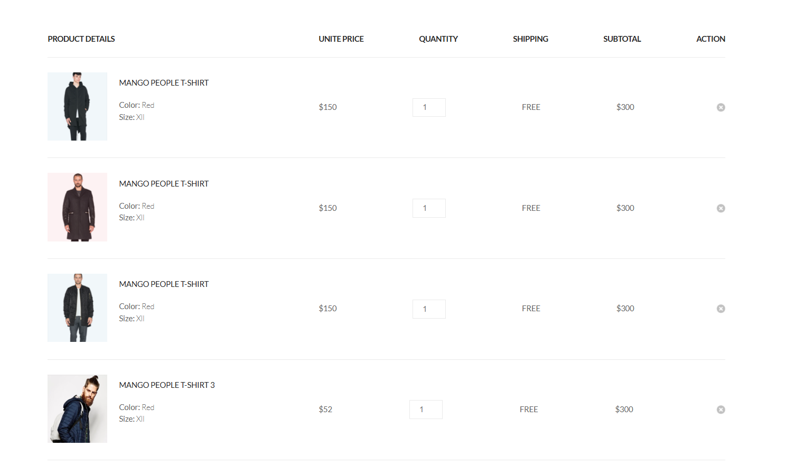

# BRAND 

Интернет-магазин одежды и аксессуаров  / Online clothing and accessories store

## Описание проекта / Description of the project

BRAND - это многостраничный сайт, интернет-магазин одежды и аксессуаров для взрослых и детей! 
BRAND is a multi-page website, an online clothing and accessories store for adults and children!

В рамках проекта я реализовала функционал корзины, который значительно улучшает пользовательский опыт. Вот основные задачи, которые я выполнила:
1. **Добавление товара в корзину**: При клике на кнопку `Add to Cart` товар добавляется в корзину, где отображаются все добавленные в корзину товары. Это позволяет пользователю легко видеть, что он выбрал.
2. **Удаление товара из корзины**: Я реализовала возможность удаления товара из раздела корзины. При нажатии на крестик товар удаляется, а если все товары удалены, раздел полностью исчезает. Это делает интерфейс более чистым и удобным.
3. **Добавление товара на страницу `shopping cart`**: Товар ранее добавленный в корзину отображается на странице `shopping_cart.html`с содержимым. Это позволяет пользователю видеть всю корзину и легко оформить заказ товаров.
4. **Удаление товара со страницы `shopping cart`**: Я реализовала возможность удаления товара со страницы корзины. При нажатии на крестик товар удаляется со страницы. Это делает интерфейс более функциональным.

As part of the project, I implemented the functionality of the shopping cart, which significantly improves the user experience. Here are the main tasks that I have completed:
1. **Adding an item to the cart**: When you click on the `Add to Cart` button, the item is added to the cart, where all the items added to the cart are displayed. This allows the user to easily see what they have selected.
2. **Deleting an item from the shopping cart**: I have implemented the option to delete an item from the shopping cart section. When you click on the cross, the product is deleted, and if all products are deleted, the section disappears completely. This makes the interface cleaner and more convenient.
3. **Adding an item to the `shopping cart` page**: An item previously added to the cart is displayed on the page `shopping_cart.html `with the contents. This allows the user to see the entire shopping cart and easily place an order for goods.
4. **Deleting an item from the `shopping cart` page**: I have implemented the option to delete an item from the shopping cart page. When you click on the cross, the product is removed from the page. This makes the interface more functional.

## Технологии / Technologies

* JavaScript API: Я использовала fetch для асинхронной работы с данными и localStorage для сохранения состояния корзины.  
* Обработка событий: С помощью addEventListener я настроила обработку кликов, чтобы добавлять товары в корзину и обновлять их количество, если они уже присутствуют.  
* Работа с DOM: Я использовала document.addEventListener("DOMContentLoaded") для инициализации приложения и insertAdjacentHTML() для динамического добавления новых товаров в корзину.  
* Динамическое обновление: Я обеспечила динамическое обновление DOM, используя querySelector для манипуляции содержимым текста, что позволяет обновлять цену и количество товаров в реальном времени.  
* Удаление элементов из корзины: Для удаления товаров я использовала метод closest(), чтобы находить родительский элемент, который нужно удалить.  
**UI/UX улучшения:**
* Я сосредоточилась на создании удобного интерфейса, где добавление товаров происходит через кнопку, а корзина автоматически обновляется при добавлении новых товаров. Пользователь также может легко удалить товар из корзины. Сохранение данных в localStorage позволяет восстанавливать корзину при перезагрузке страницы, что значительно улучшает взаимодействие с приложением.  

Таким образом, я создала функциональную и удобную корзину, которая делает процесс покупок более приятным и интуитивно понятным для пользователей.

* JavaScript API: I used fetch to work asynchronously with data and localStorage to save the bucket state.  
* Event handling: Using addEventListener, I set up click processing to add items to the cart and update their quantity if they are already present.  
* Working with DOM: I used document.addEventListener("DOMContentLoaded") to initialize the application and insertAdjacentHTML() to dynamically add new items to the cart.  
* Dynamic update: I have provided dynamic DOM updates using querySelector to manipulate the text content, which allows you to update the price and quantity of goods in real time.  
* Deleting items from the shopping cart: To delete items, I used the closest() method to find the parent item that needs to be deleted.  
**UI/UX improvements:**
* I focused on creating a user-friendly interface where adding products takes place via a button, and the shopping cart is automatically updated when new products are added. The user can also easily remove an item from the shopping cart. Saving data to localStorage allows you to restore the trash when the page is reloaded, which significantly improves the interaction with the application.  

Thus, I have created a functional and convenient shopping cart that makes the shopping process more enjoyable and intuitive for users.