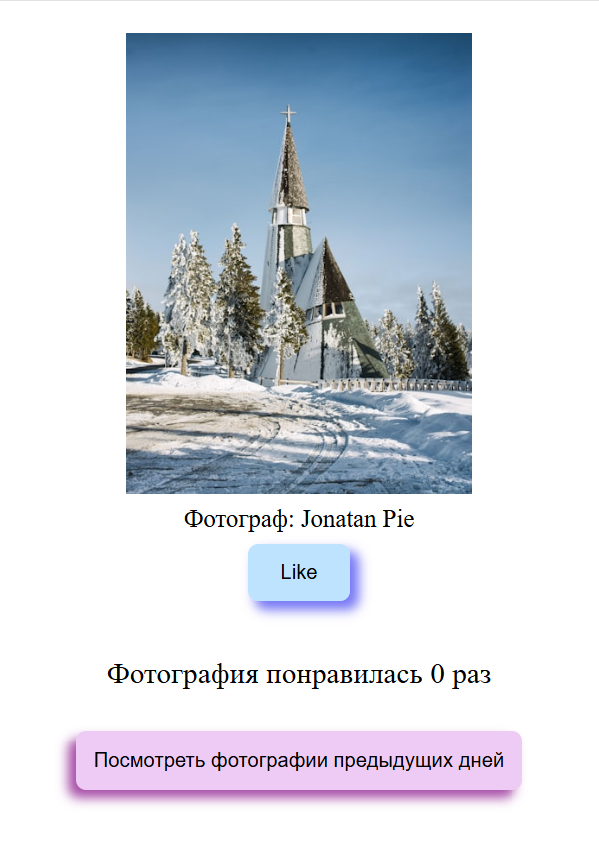

## Любимые фотографии / Favorite photos

В рамках моего проекта я создала веб-слайдер для отображения изображений на веб-странице, что стало отличной возможностью применить мои навыки в веб-разработке. Вот основные этапы, которые я выполнила:
1. **Создание интерфейса веб-страницы**: Я разработала интерфейс, который включает в себя все необходимые элементы для удобного взаимодействия с слайдером. В центре экрана я разместила контейнер для отображения текущего изображения, а также добавила кнопки "Предыдущее изображение" и "Следующее изображение" для переключения между изображениями. Кроме того, я внедрила навигационные точки (индикаторы), которые позволяют пользователю быстро переключаться между изображениями.
2. **Обработка событий с помощью JavaScript**: Я реализовала функционал переключения изображений с помощью JavaScript. При клике на кнопку "Предыдущее изображение" отображается предыдущее изображение, а при нажатии на кнопку "Следующее изображение" — следующее. Также я добавила возможность переключения к соответствующему изображению при клике на навигационные точки, что улучшает взаимодействие с слайдером.
3. **Циклическое переключение изображений**: Я обеспечила циклическое переключение между изображениями, так что после последнего изображения снова отображается первое, и наоборот. Это создает плавный и непрерывный опыт для пользователей.

-----------------------------------------------------------------------------------------------------------------------------------------

As part of my project, I created a web slider to display images on a web page, which was a great opportunity to apply my skills in web development. Here are the main steps that I have completed:
1. **Creating a web page interface**: I have developed an interface that includes all the necessary elements for easy interaction with the slider. I placed a container in the center of the screen to display the current image, and also added the "Previous image" and "Next image" buttons to switch between images. In addition, I have implemented navigation points (indicators) that allow the user to quickly switch between images.
2. **Event handling using JavaScript**: I implemented the image switching functionality using JavaScript. When you click on the "Previous image" button, the previous image is displayed, and when you click on the "Next image" button, the next one is displayed. I also added the ability to switch to the corresponding image when clicking on the navigation points, which improves interaction with the slider.
3. **Cyclic switching of images**: I have provided cyclic switching between images, so that after the last image the first one is displayed again, and vice versa. This creates a smooth and continuous experience for users.